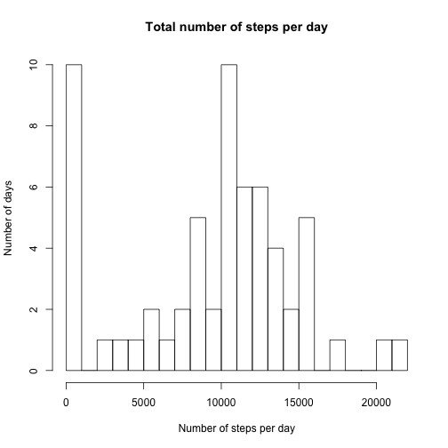
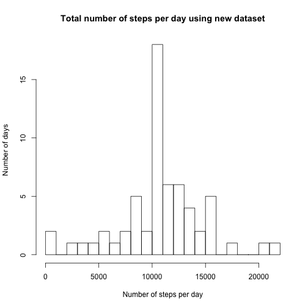
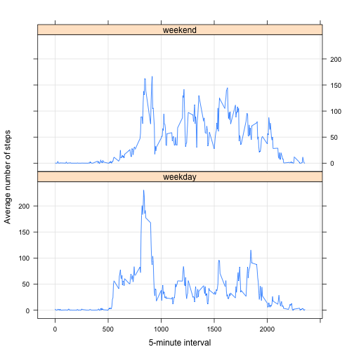

library(plyr)

####Read raw data


```r
rawData <- read.csv("activity.csv", header = TRUE, sep = ",")
rawData$date <- as.Date(rawData$date)
```

####Calculate total number of steps each day and plot a histogram


```r
stepsDay <- tapply(rawData$steps, rawData$date, FUN=sum, na.rm=TRUE)
hist(stepsDay, breaks=20, main = "Total number of steps per day",
     xlab = "Number of steps per day", ylab = "Number of days")
```

 

####Calculate mean and median number of steps per day


```r
meanDay <- mean(stepsDay, na.rm = TRUE)
round(meanDay, digits = 0)
```

```
## [1] 9354
```

```r
medianDay <- median(stepsDay, na.rm = TRUE)
round(medianDay, digits = 0)
```

```
## [1] 10395
```

Average number of steps per day = 9,354
Median number of steps per day = 10,395

####Plot a time series of average number of steps per 5-minute interval across all days


```r
library(ggplot2)

meanInterval <- aggregate(x = list(steps=rawData$steps),
                by = list(interval=rawData$interval), 
                FUN = mean, na.rm = TRUE)

ggplot(meanInterval, aes(x=interval, y=steps)) + 
    geom_line() +
    ggtitle("Average number of steps per interval") +
    xlab("5-minute intervals") +
    ylab("Average number of steps")
```

 

####Identify the 5-minute interval that has the maximum number of steps


```r
maxStep <- meanInterval[which.max(meanInterval$steps),]
round(maxStep, digits = 0)
```

```
##     interval steps
## 104      835   206
```
Interval 835 = maximum numberb of steps (206 steps)

####Imputing missing values

Calculate and report the total number of missing values in the dataset 


```r
table (is.na(rawData))
```

```
## 
## FALSE  TRUE 
## 50400  2304
```

There are 2,304 missing values in the data. 

Replace the missing values with the mean for the 5-minute interval and create a new data set


```r
newData <- rawData
newData$steps[is.na(newData$steps)] <- 
    tapply(newData$steps, newData$interval, mean, na.rm = TRUE)

#Check to make sure missing values are filled
table(is.na(newData))
```

```
## 
## FALSE 
## 52704
```

####Plot a histogram of total number of steps per day using the new dataset


```r
stepsDayNew <- tapply(newData$steps, newData$date, FUN=sum, na.rm=TRUE)
hist(stepsDayNew, breaks=20, main = "Total number of steps per day using new dataset",
     xlab = "Number of steps per day", ylab = "Number of days")
```

 

The histogram using the new dataset is closer to a mormal distribution

####Calculate mean and median number of steps per day using new dataset


```r
meanDayNew <- mean(stepsDayNew, na.rm = TRUE)
round(meanDayNew, digits = 0)
```

```
## [1] 10766
```

```r
medianDayNew <- median(stepsDayNew, na.rm = TRUE)
round(medianDayNew, digits = 0)
```

```
## [1] 10766
```

Filling in missing values caused the mean and median number of steps per day to increase which makes sense.

####Calculate differences in activity patterns between weekdays and weekends


```r
#add a factor variable to the new dataset to indicate whether a given date is a weekday or weekend day

newData$date <- as.Date(newData$date)
newData$dayType <- factor(format(newData$date, "%A"))
levels(newData$dayType) <- list(weekday=c("Monday", "Tuesday", "Wednesday", "Thursday", "Friday"), weekend=c("Saturday", "Sunday"))
```

####Make a panel plot with time series to compare average number of steps per 5-minute interval between weekdays and weekends


```r
meanIntervalNew <- aggregate(steps ~ interval + dayType,
                             data = newData, FUN = mean)

library(lattice)
xyplot(type = "l", data = meanIntervalNew,
       steps ~ interval | dayType,
       layout = c(1,2), grid = T,
       xlab ="5-minute interval",
       ylab = "Average number of steps")
```

 

More steps were taken on weekends than on weekdays.


